  
  
  

## Hi, I'm Sashi 👋

I build machine-learning systems that have to work outside the notebook:
speech recorded in noisy places, questions that switch between languages, and models that have to answer on a CPU because there's no GPU
budget. Most of my work sits where speech,
language models and plain software engineering meet. That's where the
hardest problems live, and the most interesting ones.

Most recently I built real-time AI inference for CPUs:
quantization, runtime and memory optimization, and high-concurrency streaming.
Before that I was part of the founding engineering team at FarmVaidya.ai,
building conversational AI for farmers, from speech datasets and ASR training
to fine-tuned open-source LLMs and the benchmarks we used to decide what to ship.

## What I work on

**🎙️ Speech systems across languages.** I benchmark, self-host and serve
speech-to-text for many languages, including 22 Indian languages, with
evaluation that handles every script correctly. I care as much about the
measurement as the model, because that's what lets you pick the right engine
with confidence.

**🧠 LLMs and retrieval that stay grounded.** Hybrid RAG (semantic + keyword +
reranking) over long domain documents, LoRA fine-tuning of open models on
curated instruction data, and the unglamorous pipeline work of cleaning,
chunking and structuring that makes retrieval good in the first place.

**⚡ Making it fast enough to be real-time on ordinary hardware.** Quantization,
runtime and memory optimization, warm-up and concurrency, and measuring
real-time factor instead of guessing it. A voice assistant that answers in
eight seconds isn't a voice assistant.

| Stage | Where it shows up |
|---|---|
| **Separation** | ConvTasNet speech separation in a voice agent, to pull the speaker out of background noise |
| **Speech-to-text** | [ai4bharat_stt](https://github.com/SASHI117/ai4bharat_stt), a self-hosted IndicConformer server for 22 languages. [stt-benchmark-backend](https://github.com/SASHI117/stt-benchmark-backend) compares 8 providers on WER and latency |
| **Retrieval** | Tiered hybrid RAG over a 200+ page knowledge base with sub-second retrieval, and a knowledge-base platform that ingests web pages, documents, images, audio and video |
| **LLM** | Gemma-3-4B fine-tuned with LoRA on agricultural instruction data, streaming Gemini Live for real-time conversation, and a [tool for field experts to author instruction data](https://github.com/SASHI117/llama-dataset-frontend) |
| **Speech out** | STT → LLM → TTS voice pipelines, validated end to end |

## Where I've been

| When | Where | What |
|---|---|---|
| Jun – Sep 2026 | **AUDICLABS** · AI & ML Engineer (Probation) | Built real-time AI inference on CPUs: quantization, runtime and memory optimization, high-concurrency streaming, and portable standalone runtimes for local and edge deployment |
| Dec 2025 – Jun 2026 | **FarmVaidya.ai** · AI & ML Intern | Multilingual conversational AI for agriculture: fine-tuned open LLMs, speech data pipelines, ASR training, data curation and benchmarking with field experts |
| May – Jun 2025 | **Airports Authority of India** · Intern | Telecom software infrastructure, network monitoring, fault-log analysis |
| Sep – Oct 2024 | **BSNL** · Intern | Real-time surveillance, radar and network-monitoring systems; uptime and fault detection |
| 2022 – 2026 | **GITAM University** | B.Tech in Electronics & Communication, Honours in AI & ML |

## Selected projects

<table>
<tr>
<td width="50%" valign="top">

### 🎧 [STT Benchmark](https://github.com/SASHI117/stt-benchmark-backend)
One audio clip goes to **8 speech-to-text providers (11 models)** concurrently,
and each is scored on WER and latency. It has a Unicode-aware scorer for
Indic scripts, concurrent provider fan-out, bounded polling for async
vendor APIs, and a [web UI](https://github.com/SASHI117/stt-benchmark-frontend).

`FastAPI` `SQLAlchemy` `Docker` `25 tests`

</td>
<td width="50%" valign="top">

### 🗣️ [AI4Bharat STT server](https://github.com/SASHI117/ai4bharat_stt)
Self-hosted speech-to-text for **22 Indian languages** on IndicConformer-600M.
Verified end to end with the real model: Telugu and Hindi transcribed exactly,
**faster than real time on a laptop CPU**, and a startup warm-up that makes
the first request **~4× faster**. Comes with a
[batch CLI client](https://github.com/SASHI117/users_ai4bharat_stt).

`ONNX Runtime` `FastAPI` `ffmpeg` `Docker`

</td>
</tr>
<tr>
<td width="50%" valign="top">

### 🌿 [Plant Disease Classifier](https://github.com/SASHI117/Plant-Disease-Classification)
MobileNetV2 transfer learning for 15 pepper, potato and tomato conditions.
**94.3% validation accuracy** across 15 classes, with per-class evaluation
tooling. The 10.9 MB model ships in the repo with a Gradio app, and
classifies a leaf in **~100 ms on a CPU**.

`TensorFlow` `Keras` `Gradio`

</td>
<td width="50%" valign="top">

### 💬 [Debt-Stress FinBERT](https://github.com/SASHI117/Debt-Stress-Prediction-Using-FinBERT)
FinBERT fine-tuned to grade LOW / MEDIUM / HIGH financial stress in banking
messages, with a leakage-free evaluation on message templates the model never
saw in training. It beats a TF-IDF baseline by **13 points** on unseen wording,
and trains in **under 6 minutes on a CPU**.

`Transformers` `PyTorch` `scikit-learn`

</td>
</tr>
<tr>
<td width="50%" valign="top">

### 🌾 [Crop Recommendation + SHAP](https://github.com/SASHI117/Crop_Prediction_Analysis)
Recommends one of 22 crops from soil and weather readings
(**Random Forest, 99.3% CV**). An XGBoost yield model is explained with SHAP,
and the attributions are checked against a known ground truth, so the
explanation is validated rather than assumed.

`XGBoost` `SHAP` `scikit-learn`

</td>
<td width="50%" valign="top">

### 📡 [Network Optimizer](https://github.com/SASHI117/Network-Optimizer)
A Streamlit app that combines live cell towers (OpenCelliD) and live weather
with a Random Forest signal-strength model. The model is compared against a
log-distance path-loss baseline and the shadowing noise floor, and can be
retrained on uploaded measurements.

`Streamlit` `scikit-learn` `REST APIs`

</td>
</tr>
</table>

Also: [pro-task-manager](https://github.com/SASHI117/pro-task-manager), a React +
Firebase task manager with per-user Firestore security rules, recurring tasks
and 19 unit tests.

## Work that isn't on GitHub

These weren't open-sourced, so there's nothing to link, but they're the
closest to what I do day to day:

- **🎙️ Real-time multilingual voice agent** on Gemini Live, with tiered hybrid
  RAG (semantic + keyword + reranking) over a 200+ page knowledge base,
  sub-second retrieval, and ConvTasNet speech separation for noisy
  environments. Speech → RAG → LLM → response, deployed with Docker and FastAPI.
- **📚 Knowledge base and RAG platform** that ingests web pages and documents
  (text, images, audio, video), then cleans, chunks, adds metadata and embeds
  them for vector search, with grounded Q&A exposed over REST APIs.
- **🌱 Agricultural advisory LLM**: Gemma-3-4B fine-tuned with LoRA
  (Unsloth, Hugging Face) on curated instruction data. Merged adapters were
  served with FastAPI on an Azure GPU VM behind Nginx, with HTTPS and API-key
  auth, and validated inside an STT → LLM → TTS voice pipeline.
- **🔊 Real-time speech command recognition**: a compact model on
  time-frequency features, from preprocessing to real-time inference.

## How I like to work

- **Numbers come with their evaluation.** Every metric I report comes with
  its split, its baseline and the command to reproduce it.
- **Tests ship with the code.** Every project above has CI running on every
  push, with tests that cover edge cases, not only the happy path.
- **Latency is a feature.** For voice, first-response time matters as much as
  accuracy, so I measure both.
- **Document the decisions.** Each README explains the architecture and
  the trade-offs, so the next engineer can pick it up quickly.

## Toolbox

  
   
  
   
  

<b>The full list</b>

 

- **Languages:** Python, C++, C, Java, JavaScript, HTML, CSS
- **ML / DL / NLP:** classical ML models, PyTorch, Transformers, SFT, PEFT / LoRA, FinBERT, neural networks, regression analysis, Random Forest, XGBoost, model optimization and quantization, Generative AI, multimodal AI, document intelligence, information extraction
- **Generative AI & RAG:** LLMs and SLMs, LangChain, LangGraph, RAG pipelines, knowledge-base construction, embeddings, vector, hybrid and keyword search, reranking, RAG tuning and retrieval optimization, prompt engineering, AI agents and agentic AI
- **Speech & multimodal:** STT → LLM → TTS pipelines, real-time voice AI, speech technology and separation, ASR evaluation (WER), audio, image, video and text processing, multimodal data processing
- **Serving & apps:** FastAPI, REST APIs, real-time AI systems, AI web apps and automation, Streamlit, Gradio, React, dashboards, web crawling and scraping, content extraction, document parsing
- **Tools & infra:** Git, GitHub, Hugging Face, Unsloth, Pipecat, Sherpa-ONNX, ONNX Runtime, Docker, CI/CD (GitHub Actions), Azure, GCP, AWS, Vercel, Render, Railway, Firebase, Microsoft Excel
- **Practice:** dataset building and curation, data pipelines, model evaluation and benchmarking, error analysis, latency optimization, data structures and algorithms, problem solving

## On GitHub

  If any of this overlaps with what you're building, speech for Indian
  languages, grounded LLM apps or squeezing models onto modest hardware,
  I'd like to hear about it. <b>mesashivardhan4080@gmail.com</b>

